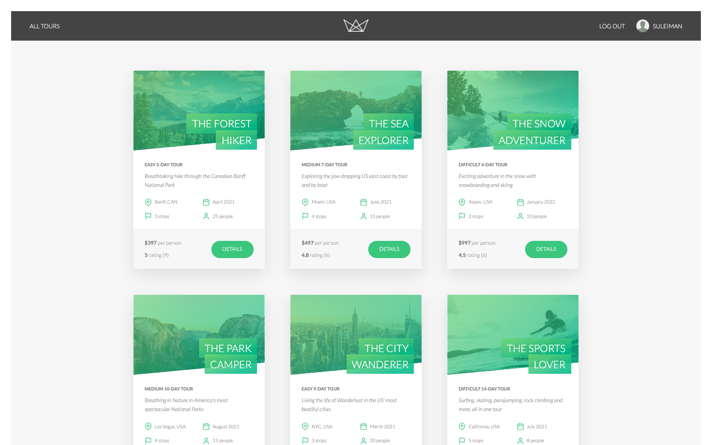
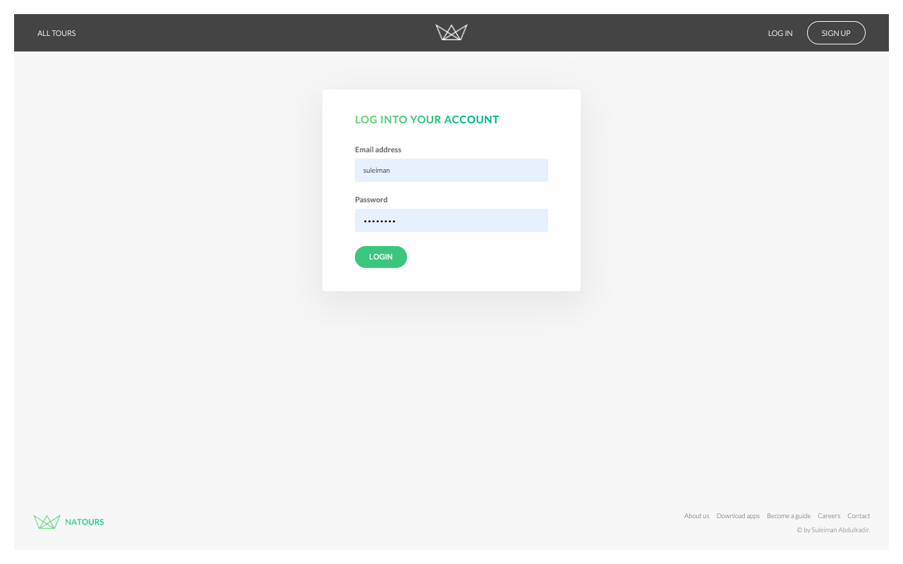
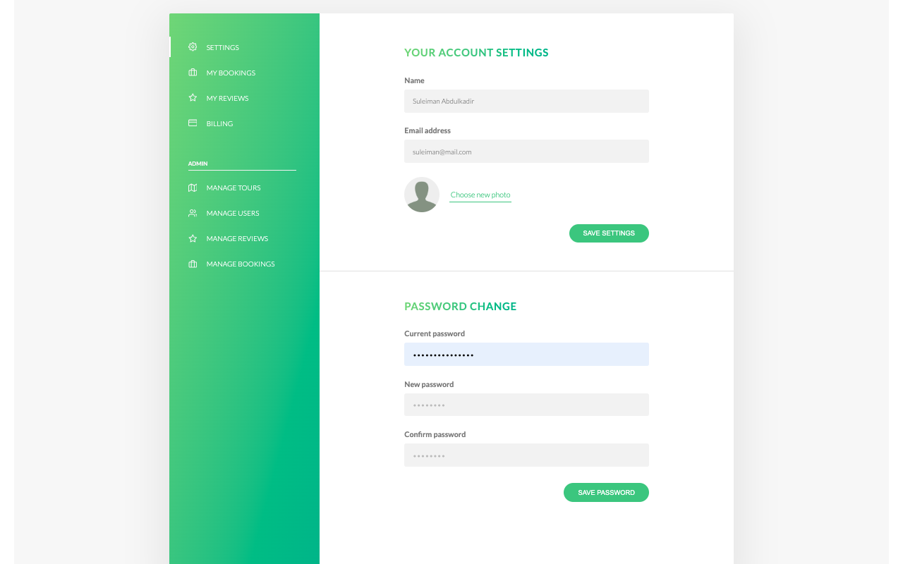

#  Tourify

Tourify is a **full-stack Node.js tour booking application** built with **Express, MongoDB (Mongoose), and Pug**.
It features RESTful APIs, server-side rendered pages, Stripe payments, authentication, and email notifications  all production-ready with security best practices.

---

##  Features

* **RESTful API** for tours, users, reviews, and bookings
* **Server-side rendering** with Pug (overview, tour details, login, account)
* **Authentication & security**: JWT, cookies, password reset via email
* **Image upload & processing** with Sharp
* **Stripe integration**: checkout flow + webhook support
* **Hardened Express app**: Helmet, rate limiting, sanitization, XSS & HPP protection
* **Client-side interactivity** with vanilla JS + static assets

---

##  Showcase

Screenshots (from `showcaseImages/`):

|                              Tours                             |                                   Tour Detail (1)                                   |
| :------------------------------------------------------------: |:-----------------------------------------------------------------------------------:|
|  |  |

|                                    Tour Detail (2)                                    |                                   Tour Detail (3)                                   |                                    Tour Detail (4)                                    |
|:-------------------------------------------------------------------------------------:|:-----------------------------------------------------------------------------------:|:-------------------------------------------------------------------------------------:|
|  |  |  |

|                              Login                             |                               Profile                              |
| :------------------------------------------------------------: | :----------------------------------------------------------------: |
|  |  |

---

##  Quick Start

1. **Clone the repo & install dependencies:**

   ```bash
   npm install
   ```

2. **Set up environment variables**
   Create a `config.env` in the project root (or copy `example.config.env`):

   ```env
   NODE_ENV=development
   PORT=3000
   DATABASE=your-mongodb-connection-string
   DATABASE_PASSWORD=your-mongodb-password
   JWT_SECRET=your-jwt-secret
   JWT_EXPIRES_IN=90d
   JWT_COOKIE_EXPIRES_IN=90
   STRIPE_SECRET_KEY=your-stripe-secret-key
   STRIPE_WEBHOOK_SECRET=your-stripe-webhook-secret
   EMAIL_FROM=your-email@example.com
   SENDGRID_USERNAME=your-sendgrid-username
   SENDGRID_PASSWORD=your-sendgrid-password
   EMAIL_HOST=your-email-host
   EMAIL_PORT=your-email-port
   EMAIL_USERNAME=your-email-username
   ```

    If you’re using MongoDB Atlas, include `<PASSWORD>` in the `DATABASE` string and replace it with `DATABASE_PASSWORD` at runtime.
   For local MongoDB, just use:

   ```
   DATABASE=mongodb://127.0.0.1:27017/tourify
   ```

3. **Run the app in dev mode:**

   ```bash
   npm run dev
   ```

   Or normally:

   ```bash
   npm start
   ```

4. **Open in browser:**
   [http://localhost:3000](http://localhost:3000)

---

##  Project Structure

```
app.js          → Express app + middleware
server.js       → App bootstrap & DB connection
controllers/    → Route handlers for API & views
models/         → Mongoose models (Tour, User, Review, Booking)
routes/         → Express routes
views/          → Pug templates (SSR pages)
public/         → Static assets (CSS, JS, images)
dev-data/       → Sample data & seeding scripts
utils/          → Helpers (email, errors, API features)
showcaseImages/ → Demo screenshots
```

---

##  Available Scripts

* `npm install` → install dependencies
* `npm run dev` → run server in dev mode (Nodemon)
* `npm start` → start server
* `npm run start:prod` → production mode (`NODE_ENV=production`)
* `npm run debug` → start with debugger (ndb)
* `npm run watch:js` / `npm run build:js` → bundle client JS with Parcel

---

##  Database Seeding

The `dev-data` folder includes sample tours, users, reviews, and a script to import/delete them.

### Import data:

```bash
node dev-data/data/import-dev-data.js --import
```

### Delete data:

```bash
node dev-data/data/import-dev-data.js --delete
```

 Expected output:

* `"DB connection successful!"`
* `"Data successfully loaded!"` (or `"deleted!"`)

️ Notes:

* Runs with `dotenv` (`config.env` must exist).
* Sample users bypass validation — for development only.
* Don’t run against production DB.

---

##  Stripe Webhooks

* Webhook endpoint: `/webhook-checkout`
* For local testing, run:

  ```bash
  stripe listen --forward-to localhost:3000/webhook-checkout
  ```
* Copy the generated `whsec_...` into your `.env` as `STRIPE_WEBHOOK_SECRET`.

---

##  Postman Collection

Test the API with the included `tourify-postman-collection.json`.

---

##  Learned From

This project is built while following:
👉 [Node.js, Express, MongoDB & More: The Complete Bootcamp](https://www.udemy.com/course/nodejs-express-mongodb-bootcamp/) by Jonas Schmedtmann

